# 🏆 Microservice Online Judge System

## 📋 Mục Lục

1. [Giới thiệu](#giới-thiệu)
2. [Kiến trúc hệ thống](#kiến-trúc-hệ-thống)
3. [Công nghệ sử dụng](#công-nghệ-sử-dụng)
   - [Kiến trúc tổng thể](#1-kiến-trúc-tổng-thể)
   - [Các Microservices chính](#2-các-microservices-chính)
4. [Các bài toán và giải pháp](#các-bài-toán-và-giải-pháp)
   - [Load Shedding](#1-load-shedding-giảm-tải-động)
   - [Distributed Lock](#2-distributed-lock-khóa-phân-tán)
   - [Caching](#3-caching-bộ-nhớ-đệm)
   - [Rate Limiting](#4-rate-limiting-giới-hạn-tốc-độ-yêu-cầu)
   - [Bảng tổng hợp](#bảng-tổng-hợp-giải-pháp)
5. [Chi tiết các Service](#chi-tiết-các-service)
   - [Problem Service](#problem-service)
   - [User Service](#user-service)
   - [Submission Service](#submission-service)
   - [Judge Worker](#judge-worker)
   - [API Gateway](#api-gateway)
6. [Sandbox Security](#sandbox-security)
7. [Giao diện hệ thống](#giao-diện-hệ-thống)
8. [Testing và Performance](#testing-và-performance)
9. [Nguồn tham khảo](#nguồn-tham-khảo)

---

## 🎯 Giới thiệu

Hệ thống **Microservice Online Judge** là một nền tảng chấm bài tự động với kiến trúc vi dịch vụ, cho phép:

- ✅ Đăng nhập/đăng xuất người dùng
- ✅ Xem danh sách đề bài và chi tiết
- ✅ Nộp bài và chấm điểm tự động
- ✅ Xem bảng xếp hạng

Hệ thống giao tiếp qua **HTTP REST API** và **RabbitMQ** message queue, với frontend React và backend Node.js.

---

## 🏗️ Kiến trúc hệ thống

### Sơ đồ tổng quan

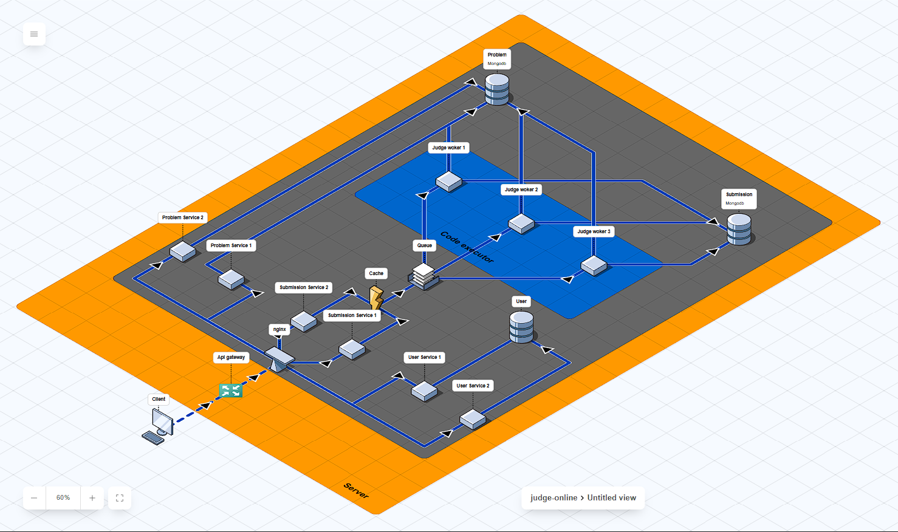

**Hướng dẫn xem sơ đồ:**

1. Truy cập: https://www.icewolfsoft.com/fossflow/
2. Upload file: [judge-online.json](judge-online.json)

---

## 💻 Công nghệ sử dụng

### 1. Kiến trúc tổng thể

| Thành phần        | Công nghệ                        | Mô tả                                |
| ----------------- | -------------------------------- | ------------------------------------ |
| **Kiến trúc**     | Microservices                    | Kiến trúc hướng dịch vụ              |
| **Backend**       | Node.js 18 + Axios               | REST API Server                      |
| **Frontend**      | ReactJS + TailwindCSS/Ant Design | Giao diện người dùng                 |
| **Deployment**    | Docker & Docker Compose          | Container hóa và quản lý dịch vụ     |
| **Cache & Queue** | Redis, RabbitMQ                  | Bộ nhớ đệm và hàng đợi tin nhắn      |
| **Database**      | MongoDB (3 instances)            | Lưu trữ users, problems, submissions |
| **Load Balancer** | Nginx                            | Cân bằng tải và proxy                |

### 2. Các Microservices chính

| Service                | Công nghệ              | Framework/Thư viện                                | Chức năng                                                     |
| ---------------------- | ---------------------- | ------------------------------------------------- | ------------------------------------------------------------- |
| **API Gateway**        | Node.js v18+           | express, axios, ioredis, express-rate-limit, cors | Định tuyến request, rate limiting, kết nối frontend ↔ backend |
| **User Service**       | Node.js v18+           | express, bcryptjs, jsonwebtoken, mongodb, ioredis | Quản lý người dùng, xác thực JWT                              |
| **Problem Service**    | Node.js v18+           | express, mongodb, ioredis                         | Quản lý bài tập, dữ liệu đề bài                               |
| **Submission Service** | Node.js v18+           | express, amqplib, mongodb, axios, ioredis         | Quản lý bài nộp, tương tác với Judge Worker                   |
| **Judge Worker**       | Java 21+ / Node.js 18+ | Spring Boot / express, amqplib, ioredis           | Chấm bài tự động qua RabbitMQ                                 |

---

## 🛠️ Các bài toán và giải pháp

### 1. Load Shedding (Giảm tải động)

**🎯 Mục đích:**

> Giảm tải có kiểm soát khi hệ thống bị quá tải tài nguyên (CPU, memory, queue đầy, I/O chậm). Thay vì để toàn hệ thống sập, một phần yêu cầu sẽ bị từ chối sớm để bảo vệ hệ thống chính.

**📊 Cách hoạt động:**

- Theo dõi: CPU usage, queue length, request latency
- Khi vượt ngưỡng (CPU > 85% hoặc queue backlog quá lớn):
  - ❌ Ngừng chấp nhận request mới
  - 🔴 Trả về mã lỗi `429 (Too Many Requests)` hoặc `503 (Service Unavailable)`
  - ⭐ Ưu tiên request quan trọng (nộp bài) > request thứ cấp (xem bảng xếp hạng)

**🔧 Áp dụng trong hệ thống:**

- Tại **API Gateway** hoặc **Submission Service**:
  - Khi hàng đợi RabbitMQ đầy → gateway tạm ngừng nhận submission mới
  - Khi Redis cache quá tải → bỏ qua caching tạm thời, truy vấn DB trực tiếp

**💡 Công nghệ hỗ trợ:**

- `express-rate-limit` (Node.js)
- Redis để giám sát tải

---

### 2. Distributed Lock (Khóa phân tán)

**🎯 Mục đích:**

> Khi nhiều instance service chạy song song cùng thao tác trên một tài nguyên chung (database, cache, queue), cần cơ chế khóa để tránh xung đột (race condition).

**📊 Cách hoạt động:**

1. Service muốn thao tác tạo khóa trên Redis: `SETNX key value`
2. ✅ Nếu thành công → được quyền thao tác
3. ⏳ Nếu khóa tồn tại → chờ hoặc bỏ qua
4. 🔓 Sau khi xong → xóa khóa (release)

**🔧 Áp dụng trong hệ thống:**

- Khi nhiều worker cùng xử lý bài nộp:
  - Tránh chấm trùng cùng 1 submission
  - Đảm bảo chỉ 1 worker xử lý một bài tại một thời điểm

**💡 Công nghệ hỗ trợ:**

- Redlock (Node.js) — qua `ioredis`
- Redis với lệnh `SET key value NX PX timeout`

---

### 3. Caching (Bộ nhớ đệm)

**🎯 Mục đích:**

> Lưu tạm dữ liệu truy cập thường xuyên vào bộ nhớ nhanh (RAM, Redis) để giảm tải DB và tăng tốc phản hồi.

**📊 Cách hoạt động:**

1. Client gửi request
2. Service kiểm tra cache (Redis)
   - ✅ **Cache hit** → trả ngay
   - ❌ **Cache miss** → truy vấn DB → lưu vào cache

**🔧 Các chiến lược cache:**

- **Write-through**: Ghi vào cache và DB đồng thời
- **Write-back**: Ghi vào cache trước, DB sau (background sync)
- **Cache-aside**: App kiểm tra cache trước khi gọi DB

**🔧 Áp dụng trong hệ thống:**

- Cache thông tin:
  - User profile
  - Bảng xếp hạng
  - Danh sách bài tập phổ biến
  - Kết quả submissions gần nhất

**💡 Công nghệ hỗ trợ:**

- `ioredis` hoặc `node-cache`

---

### 4. Rate Limiting (Giới hạn tốc độ yêu cầu)

**🎯 Mục đích:**

> Giới hạn số lượng request mà một người dùng (hoặc IP) có thể gửi trong khoảng thời gian nhất định. Ngăn spam, DDoS, và bảo vệ tài nguyên backend.

**📊 Cách hoạt động:**

- Dựa trên **token bucket** hoặc **leaky bucket** algorithm:
  - Mỗi người dùng có "xô" chứa token
  - Mỗi request tiêu tốn 1 token
  - Token được nạp lại theo thời gian

**🔧 Áp dụng trong hệ thống:**

**Tại API Gateway:**

- Giới hạn request `/submit` để tránh spam nộp bài
- Giới hạn request `/login` để tránh brute-force password

**Tại User Service:**

- Rate limit tạo tài khoản hoặc reset mật khẩu

**💡 Công nghệ hỗ trợ:**

- `express-rate-limit` (Node.js)
- `rate-limiter-flexible` (Redis backend, hỗ trợ cluster)

---

### 📊 Bảng tổng hợp giải pháp

| Giải pháp            | Mục tiêu chính                                      | Cấp độ        | Áp dụng ở đâu                    | Công nghệ                 |
| -------------------- | --------------------------------------------------- | ------------- | -------------------------------- | ------------------------- |
| **Load Shedding**    | Giảm tải khi hệ thống quá tải                       | Toàn hệ thống | API Gateway, Submission Service  | express, circuit breaker  |
| **Distributed Lock** | Ngăn race condition trong môi trường nhiều instance | Service level | Judge Worker, Submission Service | Redis (SETNX), Redlock    |
| **Caching**          | Giảm truy vấn DB, tăng tốc phản hồi                 | Service level | User, Problem Service            | Redis, ioredis            |
| **Rate Limiting**    | Ngăn spam, DDoS, abuse API                          | Gateway/API   | API Gateway, User Service        | express-rate-limit, Redis |

---

## 📦 Chi tiết các Service

### Problem Service

**🎯 Chức năng:**

- Tạo danh sách đề bài
- Lấy test cases nội bộ cho hệ thống chấm tự động
- Sử dụng Redis để cache dữ liệu giúp giảm tải MongoDB

**🔌 API Endpoints:**

- `/internal/problems/:id/testcases`: API nội bộ, chỉ Judge Worker truy cập để lấy testcases
- API Gateway / Frontend: Hiển thị danh sách đề bài và chi tiết
- Dùng projection để ẩn test cases khi hiển thị đề bài cho user

---

### User Service

**🎯 Chức năng:**

- Quản lý thông tin người dùng
- Kết nối với MongoDB
- Xử lý thêm dữ liệu vào users database

#### 🚀 Bài toán: Xử lý hàng nghìn/triệu User cùng lúc

**❓ Thách thức:**

> Khi đẩy hàng nghìn/triệu User vào DB cùng lúc, làm sao xử lý với 1 container user-service?

**✅ Giải pháp:**

**1. Replica + Distributed Lock**

- Tăng số lượng container thông qua replica
- Sử dụng **distributed lock** của Redis để khóa, tránh duplicate key khi nhiều container cùng thêm 1 user

**2. Tối ưu với Atomic Counter**

- Vấn đề: Khi bị lock, chỉ 1 container làm việc, các container khác rỗi → tốn bộ nhớ
- Giải pháp: Redis **atomic counter** (tăng giá trị key lên 1 đơn vị một cách toàn vẹn)
- Chia thành các batch cho các container mà không cần lock thủ công
- Đảm bảo không trùng lặp và chạy song song

**3. Kết hợp tối ưu**

- Scale containers phù hợp
- Sử dụng các cơ chế Redis:
  - **Distributed lock** init
  - **Atomic counter**
  - **Redis TTL** phân tán task
- Tối ưu tốc độ lưu trữ và cải thiện CPU

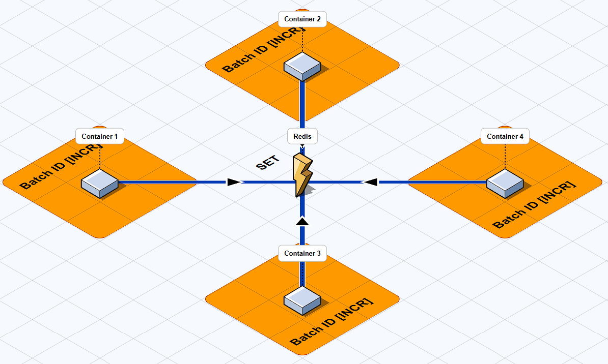

**📝 Commands:**

```bash
# Chạy k containers song song
docker-compose up -d --build --scale user-service=k

# Upload data vào MongoDB với k services
for i in {1..k}; do
  docker exec source-user-service-$i node seed-data.js &
done
wait
echo "All seed processes completed"
```

---

### Submission Service

**🎯 Chức năng:**

- Nhận và quản lý bài nộp từ người dùng
- Push job vào RabbitMQ để Judge Worker xử lý
- Cập nhật trạng thái submission

#### 🚀 Bài toán 1: Xác định người nộp đầu tiên khi hàng nghìn user submit cùng lúc

**✅ Giải pháp:**

**1. Distributed Lock**

- Dùng distributed lock trong Redis (3s) để khóa người nộp, tránh spam

**2. Atomic Counter**

- Tăng key lên 1 để tránh race condition
- Race condition: Khi nhiều tiến trình dùng chung tài nguyên cùng lúc và không xác định được thứ tự

**Ví dụ Race Condition:**

| Time | Process1    | Process2    | cnt | Vấn đề                     |
| ---- | ----------- | ----------- | --- | -------------------------- |
| 1    | read 0      |             | 0   |                            |
| 2    |             | read 0      | 0   | ❌ Cả 2 cùng đọc giá trị 0 |
| 3    | cal 0+1=1   |             | 0   |                            |
| 4    |             | cal 0+1=1   | 0   |                            |
| 5    | write cnt=1 |             | 1   |                            |
| 6    |             | write cnt=1 | 1   | ❌ Sai! Chỉ tăng 1 lần     |

**Với Atomic Counter:**

| Time | Process1                | Process2 | cnt | Kết quả              |
| ---- | ----------------------- | -------- | --- | -------------------- |
| 1    | INCR(read, incr, write) |          | 0   |                      |
| 2    | processing(0→1)         | wait     | 0   | ⏳ Process2 phải chờ |
| 3    | end INCR                |          | 1   | ✅ Đúng thứ tự       |

---

#### 🚀 Bài toán 2: Xử lý hàng nghìn user submit không crash hệ thống

**❓ Thách thức:**

- Hàng nghìn request `/submit` phải xử lý ổn định, không nghẽn
- User không phải chờ quá lâu
- Giảm queue backlog và response latency

**✅ Giải pháp:**

**1. RabbitMQ Queue**

- Sử dụng giao thức **AMQP** (Advanced Message Queuing Protocol)
- Đảm bảo độ tin cậy khi gửi gói tin và định tuyến
- User nhấn submit → hệ thống gửi message vào RabbitMQ → xếp hàng chờ
- Judge workers xử lý song song

**Cấu hình:**

- Queue name: `judge_submissions`
- 3 worker containers
- Mỗi worker xử lý đồng thời 5 messages

**2. Redis Lock**

- Tránh spam submit (người dùng chỉ được submit mỗi 3 giây)

**3. Redis Counter & Cache**

- Truy xuất nhanh, không query MongoDB liên tục → giảm tải I/O
- Áp dụng pattern **Cache-aside**: Nếu có trong cache → lấy luôn, nếu không → query DB → lưu vào cache

**4. MongoDB Connection Pool**

- Cho phép tối đa kết nối đồng thời
- Giảm độ trễ khi insert nhiều submission

**5. Horizontal Scaling**

- Chạy 2+ instances submission-service qua replica trong docker-compose

**6. Estimated Wait Time**

- Ước lượng thời gian: 10 submissions xử lý trong 1s
- User thấy thời gian chờ thực tế trên UI

---

#### 🧪 Bài toán 3: Test 10,000 user cùng submit cùng lúc

**🎯 Mục tiêu:**

- Kiểm tra hệ thống có crash, nghẽn hàng đợi, hoặc xử lý chậm không?

**🔧 Cách test:**

- Sử dụng **Worker Threads** để giả lập 10,000 người cùng submit
- Tạo tối đa 8 workers chạy song song
- Mỗi worker gửi requests cho các nhóm user riêng
- Tổng hợp kết quả

**📊 Kiểm tra:**

- ✅ Redis lock: Có bottleneck không?
- ✅ RabbitMQ: Queue có đầy hoặc delay không?
- ✅ MongoDB Pool: Tốc độ ghi submission record
- ✅ API Layer: Độ trễ trung bình của `/submit` endpoint
- ✅ Race condition: Có lỗi trùng submissionId, duplicate record không?

---

### Judge Worker

**🎯 Chức năng:**

- Chấm bài theo C++, Java, Python, Javascript
- Sử dụng **Sandbox VM2** để chấm an toàn

**📋 Quy trình hoạt động:**

**1. Submission Service:**

- Nhận request submit
- Ghi trạng thái `pending` vào DB
- Push job vào RabbitMQ Queue: `judge_submissions`

**2. Judge Worker:**

- Kết nối Redis để lưu trạng thái nhanh (judging, result, stats)
- Kết nối RabbitMQ để nhận submission job
- Dùng `prefetch(MAX_CONCURRENT_JOBS)` để giới hạn số job song song (mặc định 5)

**3. Quy trình chấm bài:**

- Nhận job từ RabbitMQ
- Chấm bài dựa trên ngôn ngữ: JS, Python, Java _(C++ đang sửa format)_
- So sánh output với test cases chuẩn
- Cập nhật lại submission-service qua REST API
  - Từ `judging` → `completed`
  - Kết quả: `accepted` | `wrong_answer` | `failed`
- Ghi cache vào Redis: `result:submissionId`
- Ghi thống kê vào Redis: `stats:*`

**4. Cập nhật User Service:**

- Khi bài được `accepted` → worker gọi `POST /internal/user/{userId}/solved`
- Tăng điểm và cập nhật danh sách problem đã giải

---

### API Gateway

**🎯 Chức năng:**

- Định tuyến request giữa các services
- Rate limiting và CORS
- Kết nối frontend với backend

**⚠️ Trạng thái:**

> Hiện tại mới cấu hình cơ bản để kết nối các service với nhau. Chưa tối ưu hoàn toàn.

---

## 🔒 Sandbox Security

### Sandbox là gì?

**🛡️ Định nghĩa:**

> Sandbox là môi trường chạy mã nguồn bị cô lập. Trong sandbox, chương trình chỉ được phép:

1. ✅ Chạy trong giới hạn tài nguyên: CPU, RAM, Time
2. ❌ Không được truy cập FileSystem, Internet
3. ❌ Không được truy cập bộ nhớ máy thật
4. ❌ Không thể gây crash hay chiếm quyền hệ thống

### Tại sao Online Judge phải dùng Sandbox?

**⚠️ Rủi ro:**

1. 🚨 Người dùng có thể gửi mã độc
2. 🔄 Người dùng có thể gửi code vô hạn, gây infinite loop
3. 🔓 Người dùng có thể đọc file system, tấn công server, đánh cắp dữ liệu

**✅ Giải pháp của Sandbox:**

**1. Security (Bảo mật):**

- Chặn truy cập: filesystem, network, process system
- Ngăn hacker gửi code phá server

**2. Resource Limiting (Giới hạn tài nguyên):**

- Áp dụng CPU, RAM, Time limiter
- Nếu vượt quá → program bị kill ngay (TLE, MLE, RE)

**3. Môi trường đồng nhất:**

- Tạo môi trường giống nhau cho mọi bài nộp
- Không ai được ưu tiên hay gian lận tài nguyên

**4. Ngăn Crash System:**

- Nếu crash trong sandbox → system vẫn an toàn

### Cách hoạt động của Sandbox

```
1. User nhấn submit → System compile code
2. Create sandbox (bằng container)
3. Copy input test vào sandbox
4. Run code trong giới hạn tài nguyên
5. Thu output → so sánh với đáp án
6. Xóa sandbox → Không còn dấu vết
```

### Sandbox được xây dựng như thế nào?

**🔧 Công nghệ:**

1. **Docker**: Container hóa môi trường
2. **Seccomp**: Chặn các system call nguy hiểm (open, exec, socket,...)
3. **Cgroups**: Giới hạn CPU, RAM, IO
4. **Chroot**: Biến thư mục chạy thành root directory mới → Không truy cập ra ngoài

**📚 Ví dụ thực tế:**

- **Codeforces** dùng:
  - `isolate` (sandbox của Olympic IOI)
  - seccomp
  - cgroups
- **LeetCode / HackerRank**: Sử dụng container công nghệ tương tự Docker

---

## 🖥️ Giao diện hệ thống

### Database & Management UIs

1. **Problems DB**: http://localhost:8081
   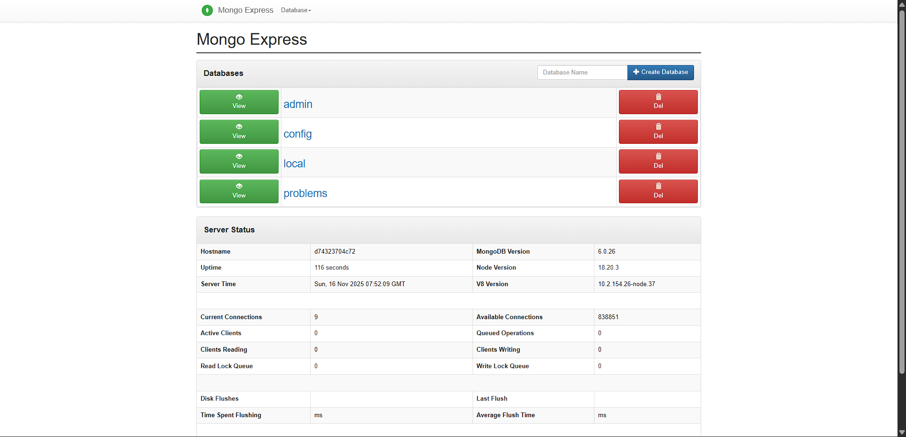

2. **Submissions DB**: http://localhost:8082
   

3. **Users DB**: http://localhost:8083
   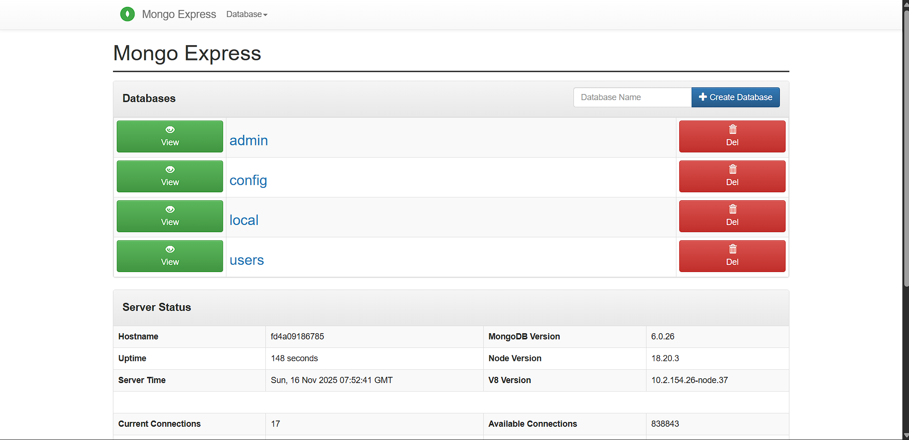

4. **RabbitMQ Management**: http://localhost:15672
   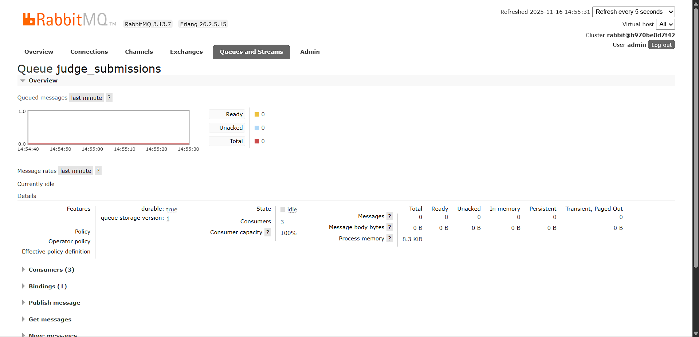

### Frontend Pages

5. **Login & Register**: http://localhost
   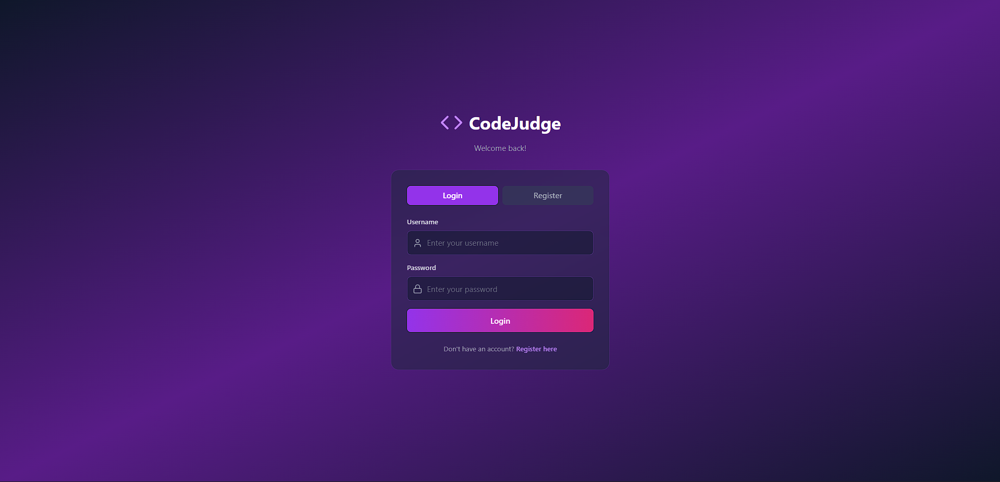
   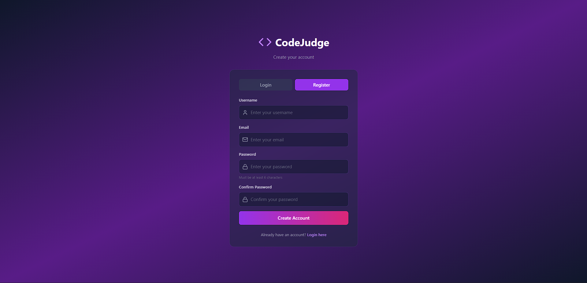

6. **Home**: http://localhost/home
   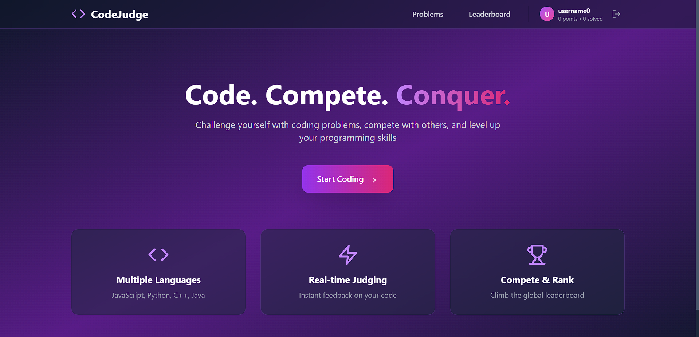

7. **Problems List**: http://localhost/problems
   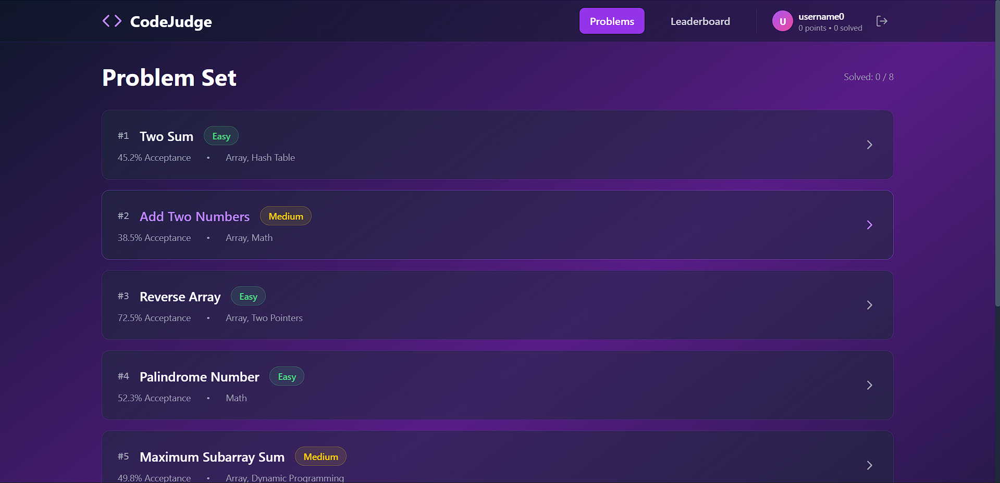

8. **Problem Detail**: http://localhost/problem/:id
   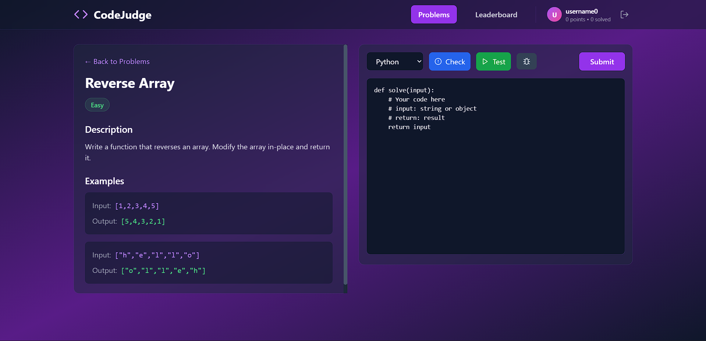

9. **Submit Solution**:
   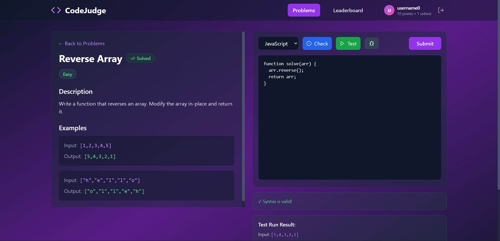
   

10. **Leaderboard**: http://localhost/leaderboard
    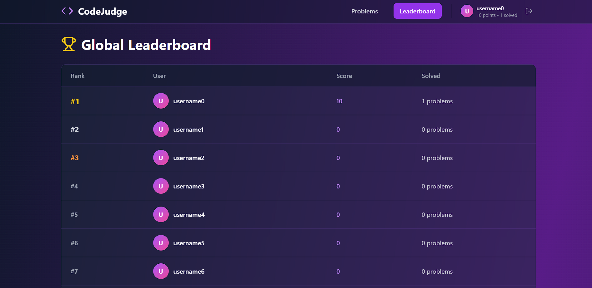

---

## 🧪 Testing và Performance

### Cách chạy Load Test

```bash
cd source/server/load-testing
npm install
MAX_USERS=1000 node load-test.js
```

### Kết quả Test

#### Test 1: 1,000 Users

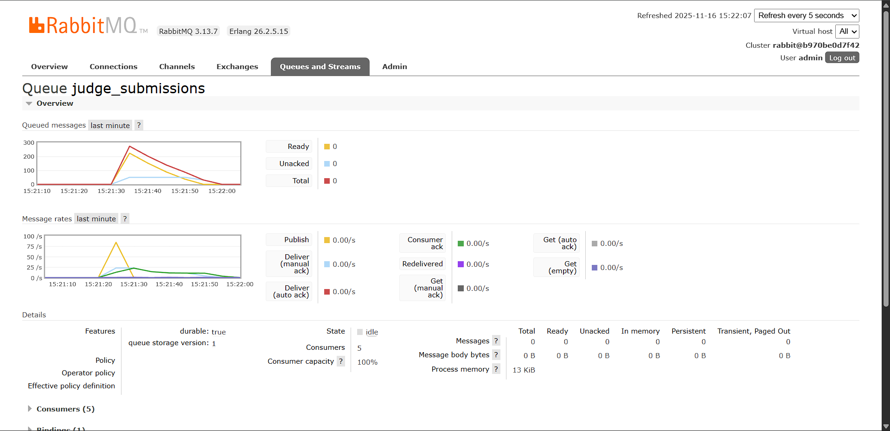

**📊 Kết quả:**

- ✅ Thời gian xử lý: **30 giây**
- ✅ Tất cả submissions: **Accepted**
- ⚙️ Cấu hình: 5 workers
- 💡 Có thể tối ưu thêm

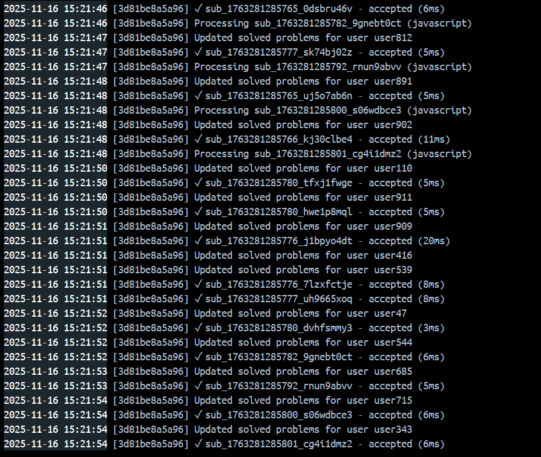
_Log của 1 trong 5 workers xử lý_

#### Test 2: 10,000 Users

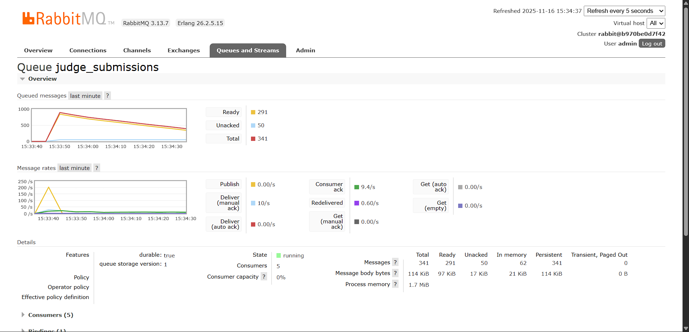
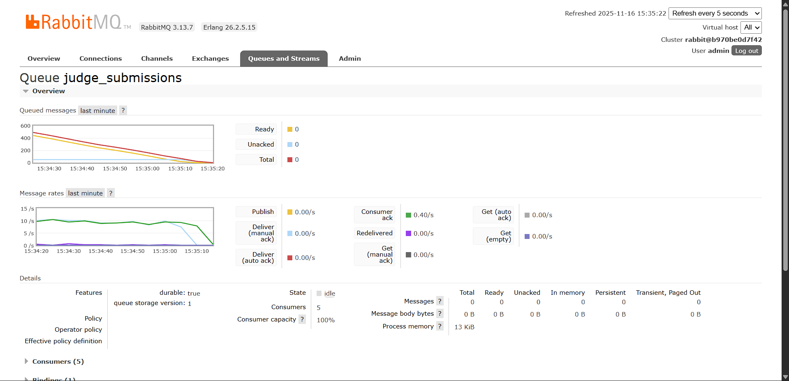

**📊 Kết quả:**

- ✅ Thời gian xử lý: **90 giây**
- ✅ Tất cả submissions: **Successful**
- 💡 Có thể tối ưu thêm

---

## 📚 Nguồn tham khảo

1. [IOI Isolate Sandbox](https://github.com/ioi/isolate)
2. [Docker Security Documentation](https://docs.docker.com/engine/security/)
3. [Codeforces Blog về Sandbox](https://codeforces.com/blog/entry/79)

---

## 📝 License

*tunhoipro0306@gmail.com*

## 👥 Contributors

_Personal_

---

**🚀 Happy Coding!**
